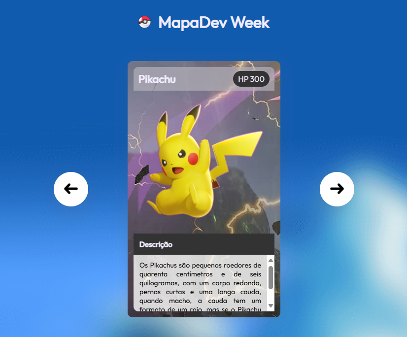

# ⚡ Pokémon Slider
<p align="center">
  <!-- Contador de linguagens do GitHub -->
  
  <!-- Tamanho do repositório no GitHub -->
  
  <!-- Licença do GitHub -->
  
</p>

<div align="center">
  
</div>

## 🛠️ Tecnologias Utilizadas
- **HTML5**: Estruturação do conteúdo da página.
- **CSS3**: Estilização e design do slider.
- **JavaScript**: Funcionalidade de navegação entre os cartões.

## 🖼️ Funcionalidade do Slider
- **Avançar**: Clique no botão com a seta para avançar para o próximo cartão de Pokémon.
- **Voltar**: Clique no botão com a seta para voltar ao cartão anterior.

## 📚 Recursos Adicionais
- [MDN Web Docs - JavaScript](https://developer.mozilla.org/en-US/docs/Web/JavaScript)
- [MDN Web Docs - HTML](https://developer.mozilla.org/en-US/docs/Web/HTML)
- [MDN Web Docs - CSS](https://developer.mozilla.org/en-US/docs/Web/CSS)

## 🔍 Visualize o Projeto
Confira o projeto online através deste [link](https://devandreotti.github.io/sliderpokemon/).

## 📁 Estrutura do Projeto
```
├── index.html                              # Arquivo HTML que define a estrutura da página e inclui os elementos do slider
├── src/                                   # Diretório principal do projeto
│   ├── css/                               # Arquivos CSS para estilização e responsividade
│   │   ├── reset.css                      # Estilos básicos para resetar padrões de navegador
│   │   ├── estilos.css                    # Estilos principais do slider
│   │   └── responsivo.css                  # Estilos específicos para dispositivos móveis
│   ├── js/                                # Scripts JavaScript
│   │   └── index.js                       # Script JavaScript para gerenciar a navegação entre os cartões
│   └── imagens/                           # Imagens utilizadas no projeto
│       ├── icons/                         # Ícones
│       └── pokemons/                      # Imagens dos Pokémon
└── README.md                              # Documentação do projeto
```

## 🚀 Como Rodar o Projeto
1. **Clone o Repositório**
   ```bash
   git clone https://github.com/devAndreotti/sliderpokemon.git
2. **Abra o Arquivo HTML**
   Abra o arquivo `index.html` em um navegador para visualizar o projeto.

## 💪 Contribuição
Contribuições são bem-vindas! Para contribuir, siga estas etapas:
1. Faça um fork do projeto.
2. Crie uma nova branch para sua feature `git checkout -b feature/nome-feature`.
3. Commit suas mudanças `git commit -m 'Adiciona nova feature'`.
4. Envie para a branch `git push origin feature/nome-feature`.
5. Abra um Pull Request.

## 📌 Nota
Este projeto é para fins educacionais e demonstra a manipulação dinâmica de estilos com CSS e JavaScript. Sinta-se livre para explorar, modificar e adaptar conforme necessário.
